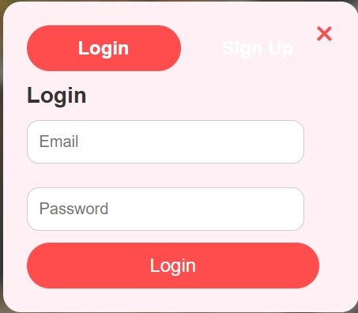
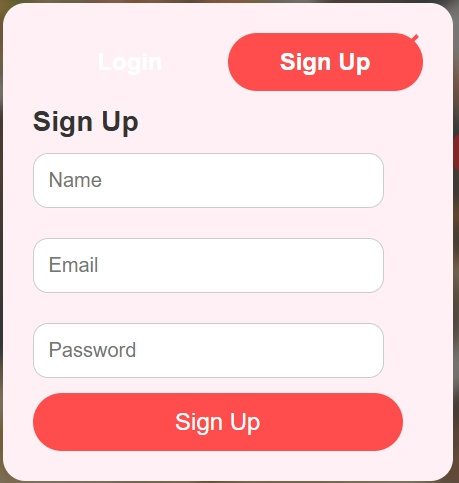
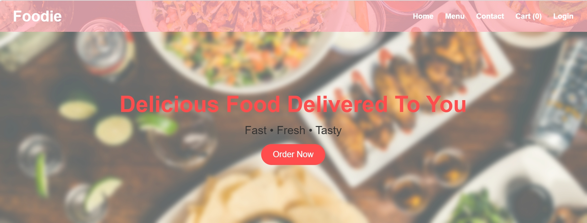
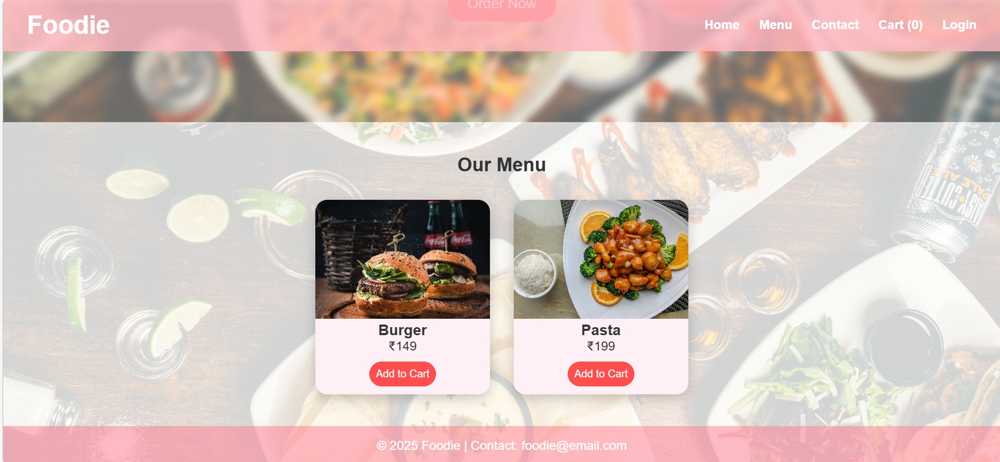

##  Overview
The **Foodie Delivery** web application is a demonstration project designed to showcase a basic food ordering experience with a visually appealing soft red user interface. It highlights the flow from authentication to menu browsing, mimicking real-world food delivery platforms in a simple, beginner-friendly way.

## 🌟 Features
- 🔐 **Login & Signup System** — allows users to enter the app in an organized and structured way.  
- 📋 **Menu Display** — clean, easy-to-navigate layout showcasing food items.  
- 🎨 **Soft Red UI Theme** — minimal design with attractive tones for a smooth user experience.  
- 🛍️ **Food Selection** — users can browse and select items effortlessly.  
- 🧑‍💻 **Demonstration Focus** — emphasizes frontend design and UI flow rather than full backend functionality.  

## 📂 Tech Stack
- **Frontend:** HTML, CSS, JavaScript  
- **Design:** Minimal, soft red theme with structured layout  
- **Focus:** Beginner-friendly, showcasing food delivery UI concepts

### Login Page

### Signin Page

### home Page

### Menu Page

